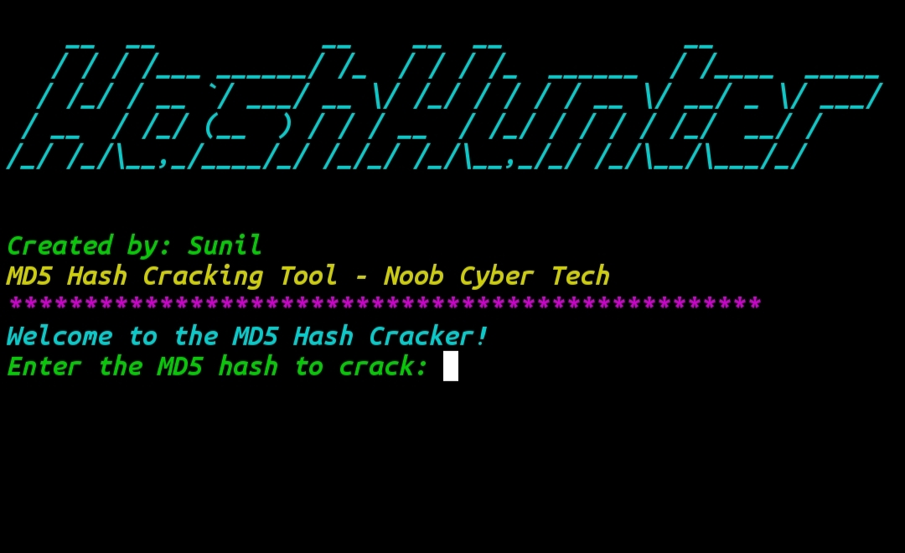

<h1 style="color:#3498db; font-size:50px;">🌟 Hash Hunter - MD5 Hash Cracking Tool 🌟</h1>

<b style="font-size:20px;">🔒 Simplifying Hash Cracking for Ethical Hackers and Cybersecurity Enthusiasts!</b>

<h2 style="color:#2ecc71;">🔥 What is Hash Hunter?</h2>

Hash Hunter is a <b>lightweight and powerful MD5 hash cracking tool</b>, specially designed for ethical hackers and penetration testers. This tool helps you decode MD5 hashes with speed and accuracy, leveraging <b>wordlist-based attacks</b>.

<h2 style="color:#f1c40f;">⚙️ Key Features</h2>
<ul>
  <li>✔️ <b>Fast and Efficient</b>: Optimized to crack MD5 hashes quickly.</li>
  <li>✔️ <b>Wordlist Support</b>: Use custom or pre-built wordlists for cracking.</li>
  <li>✔️ <b>Beginner-Friendly</b>: Simple, intuitive CLI interface.</li>
  <li>✔️ <b>Cross-Platform</b>: Works on Linux, Termux, and Windows environments.</li>
</ul>

---

🌟 Hash Hunter - MD5 Hash Cracking Tool 🌟

🔒 Simplifying Hash Cracking for Ethical Hackers and Cybersecurity Enthusiasts!

---

🔥 What is Hash Hunter?

Hash Hunter is a lightweight and powerful MD5 hash cracking tool, specially designed for ethical hackers and penetration testers. This tool helps you decode MD5 hashes with speed and accuracy, leveraging wordlist-based attacks.

> 🚀 Perfect for:

Password Recovery

Penetration Testing

Learning Hash Cracking Techniques

---

⚙️ Key Features

✔️ Fast and Efficient: Optimized to crack MD5 hashes quickly.
✔️ Wordlist Support: Use custom or pre-built wordlists for cracking.
✔️ Beginner-Friendly: Simple, intuitive CLI interface.
✔️ Cross-Platform: Works on Linux, Termux, and Windows environments.

---

📋 Dependencies

Python 3 Ensure Python is installed.

pip: Python package manager (comes with Python).

Python Modules:

The following modules are needed (install them with pip):

hashlib

argparse

requests

You can install all dependencies with one command:

pip install hashlib argparse requests

<h2 style="color:#e74c3c;">📖 How to Install & Run</h2>
<ol>
  <li><b>Clone the Repository:</b> 
  <code>git clone tool link .git</code> 
  <code>cd hashhunter</code></li>
  <li><b>Install Dependencies:</b> 
  <code>pip install -r requirements.txt</code></li>
  <li><b>Run the Tool:</b> 
  <code>python hashhunter.py --hash &lt;hash&gt; --wordlist &lt;path-to-wordlist&gt;</code></li>
</ol>

<h2 style="color:#e67e22;">⚠️ Disclaimer</h2>

<b>This tool is intended for ethical and educational purposes only.</b> 
Using this tool for illegal activities is strictly prohibited and may result in severe legal consequences.

<h1 style="color:#9b59b6;">💡 Make Your Cracking Smarter with Hash Hunter!</h1>
